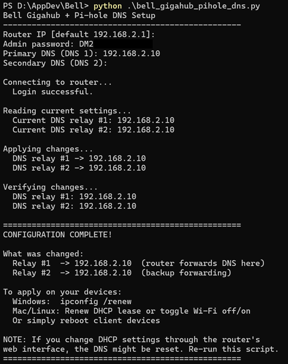

# Gigahub Local DNS

Change the DNS relay settings on a Bell Gigahub while keeping the router's DHCP
server enabled.

Bell's Gigahub web interface does not allow a DNS server that uses a LAN IP
address. That blocks common local DNS setups such as Pi-hole. This script works
by talking directly to the Gigahub JSON-RPC API and updating the router's DNS
relay forwarding targets. Devices can continue to receive their IP addresses
from the Gigahub DHCP server, but DNS queries sent to the router are forwarded
to the DNS server you choose.

## What This Changes

The script updates these Gigahub settings:

```text
Device/DNS/Relay/Forwardings/Forwarding[1]/DNSServer
Device/DNS/Relay/Forwardings/Forwarding[2]/DNSServer
```

It does not disable DHCP, replace the DHCP server, or change your LAN IP range.

## Requirements

- Python 3.6 or newer
- A Bell Gigahub reachable from your computer
- The Gigahub admin password
- The IP address of the DNS server you want clients to use

No extra Python packages are required.

## Usage

Download and run:

```powershell
python bell_gigahub_pihole_dns.py
```

The script prompts for:

```text
Router IP [192.168.2.1]
Admin password
Primary DNS (DNS 1):
Secondary DNS (DNS 2):
```

If your Pi-hole is at `192.168.2.10`, you can press Enter for the default DNS
prompts. To use one DNS server only, leave secondary blank to reuse the primary
DNS value.

After the script finishes, renew the DHCP lease on your client devices so they
start using the updated router DNS relay path:

```powershell
ipconfig /renew
```

On macOS, Linux, phones, and tablets, renew the DHCP lease, toggle Wi-Fi off and
on, or reboot the device.

## Screenshot



## How It Works

1. The script asks for the router IP, admin password, primary DNS server, and
   secondary DNS server.
2. It hashes the admin password with SHA-512 in the format expected by the
   Gigahub login API.
3. It opens a JSON-RPC login request to `http://<router-ip>/cgi/json-req` as the
   `admin` user.
4. When login succeeds, the router returns a session ID and nonce.
5. The script uses the nonce, request ID, client nonce, and session details to
   compute the `auth-key` required for later API calls.
6. It reads the current DNS relay forwarding values, when available, so you can
   see what is already configured.
7. It calls `setValue` for DNS relay forwarding slot 1 and slot 2, setting them
   to the DNS IP addresses you entered.
8. It reads the same values again to verify that the router accepted the change.
9. It prints a summary and reminds you to renew DHCP leases on client devices.

The key idea is that LAN clients may still ask the Gigahub for DNS, but the
Gigahub's DNS relay forwards those queries to your chosen DNS server.

## About The URLs

The script calls `http://<router-ip>/cgi/json-req`, which is the local Gigahub
API endpoint used by the router's own web interface. This is a request to your
router on your LAN, not an external website.

The `http://sagemcom.com/gateway-data` value in the request body is an API
namespace identifier used by the router firmware to identify the gateway data
model. It is sent as text inside the local router API request; the script is not
opening that website.

## Notes

- This worked as of June 19, 2026. If Bell changes the Gigahub firmware, this
  method may need to be updated.
- If you later change DHCP-related settings in the Gigahub web interface, the
  DNS relay settings may be reset. Re-run the script if that happens.
- Use a DNS server address that is reachable from your LAN.
- Keep your router admin password private. The script asks for it locally and
  uses it only to authenticate to the router.

## AI Disclosure

This project includes some AI-generated code.

## License

This project is licensed under the MIT License. See [LICENSE](LICENSE).
