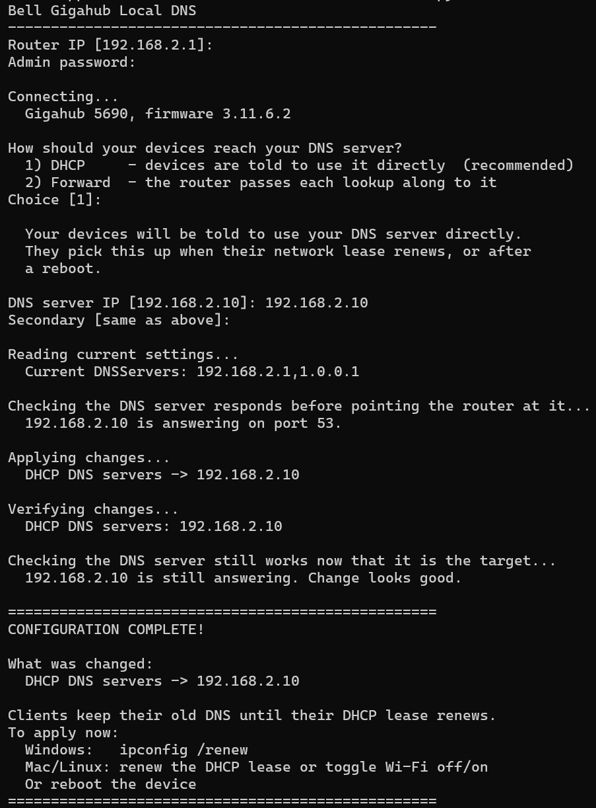

# Gigahub Local DNS

Point a Bell Gigahub at a DNS server on your own LAN while keeping the router's
DHCP server enabled.

Bell's Gigahub web interface does not allow a DNS server that uses a LAN IP
address. That blocks common local DNS setups such as Pi-hole, AdGuard, or
Unbound. This script works by talking directly to the Gigahub JSON-RPC API and
updating the router's DNS. Devices can continue to receive their IP addresses
from the Gigahub DHCP server, but DNS queries sent to the router are forwarded
to the DNS server you choose.

## What This Changes

The script offers two methods and asks which one you want to use.

**DHCP (default).** The Gigahub tells each client to use your DNS server
directly:

```text
Device/DHCPv4/Server/Pools/Pool[1]/DNSServers
```

**Relay.** Clients keep asking the Gigahub, which forwards the queries:

```text
Device/DNS/Relay/Forwardings/Forwarding[1]/DNSServer
Device/DNS/Relay/Forwardings/Forwarding[2]/DNSServer
```

It does not disable DHCP, replace the DHCP server, or change your LAN IP range.

## Requirements

- Python 3.6 or newer
- A Bell Gigahub reachable from your computer
- The Gigahub admin password
- The IP address of the DNS server you want clients to use

No extra Python packages are required.

## Usage

Download and run:

```powershell
python bell_gigahub_pihole_dns.py
```

The script prompts for:

```text
Router IP [192.168.2.1]
Admin password
Choice [1] / [2]
Primary DNS
Secondary DNS
```

The script asks which method to use, then asks which IP address should receive
the queries.
`192.168.2.10` is the default DNS server IP address.

Before applying the changes, the script checks that your DNS server answers on
port 53. Afterwards, it checks again and restores your previous settings if it
has gone quiet, so a failed attempt will not leave the LAN without DNS.

After the script finishes, renew the DHCP lease on your client devices so they
start using the updated DNS server:

```powershell
ipconfig /renew
```

On macOS and Linux devices, phones, and tablets, renew the DHCP lease, toggle
Wi-Fi off and on, or reboot the device.

The script prints your router's model and firmware version right after logging
in, so you can stop there if you only wanted to check what you have.

## What This Was Tested On

The script was tested on a first-generation Gigahub (`ModelName 5690`).

| Firmware | DHCP method | Relay method |
| --- | --- | --- |
| `3.11.6.2` | works | works |
| `2.14.2` | works | **cuts your DNS server off the network** |

**Any other model or firmware is untested and may not work at all.**

Regardless of the version, the script checks that your DNS server is still
resolving DNS queries after the change and puts your old settings back if it is
not.

### What each firmware can do

`3.11.6.2` accepts a LAN address in either place. Both methods work, so you can
pick whichever suits you.

`2.14.2` accepts a LAN address for DHCP but not for the relay. Use the DHCP
method. In relay mode, the modem cuts off network access to the selected DNS
server, making both the DNS change and your internet connection unusable.

## Screenshot



## How It Works

1. The script asks for the router IP, admin password, primary and secondary DNS
   server addresses, and which method to use.
2. It hashes the admin password with SHA-512 in the format expected by the
   Gigahub login API.
3. It sends a JSON-RPC login request to `http://<router-ip>/cgi/json-req` as the
   `admin` user.
4. When login succeeds, the router returns a session ID and nonce.
5. The script uses the nonce, request ID, client nonce, and session details to
   compute the `auth-key` required for later API calls.
6. It reads the router's model and firmware version, and reports whether that
   firmware is known to have trouble with the relay method.
7. It reads the current value of the setting that the selected method will
   overwrite and keeps it so the change can be undone.
8. It calls `setValue` on the DHCP pool's DNS servers, or on relay forwarding
   slots 1 and 2, then reads the values back to confirm they were accepted.
9. It queries your DNS server once more. If it has stopped answering, the values
   from step 7 are put back and the script exits with an error.
10. It prints a summary and, for the DHCP method, reminds you to renew leases.

With the DHCP method, clients talk to your DNS server themselves. With the relay
method, clients still ask the Gigahub, and the Gigahub forwards those queries to
the DNS server you chose.

## About The URLs

The script calls `http://<router-ip>/cgi/json-req`, which is the local Gigahub
API endpoint used by the router's own web interface. This is a request to your
router on your LAN, not an external website.

The `http://sagemcom.com/gateway-data` value in the request body is an API
namespace identifier used by the router firmware to identify the gateway data
model. It is sent as text inside the local router API request; the script is not
opening that website.

## Troubleshooting

### Your DNS server loses all network access

You used the relay method on firmware that does not support it. Rerun the script
and choose DHCP instead.

The script should have restored your settings automatically and exited with an
error. If it did not, set the two relay slots back to public resolvers such as
`1.1.1.1` and `1.0.0.1`, either by rerunning the script in relay mode or by using
the router's web interface. The DNS server should regain network access
immediately.

## Notes

- Verified against firmware `2.14.2` and `3.11.6.2` on August 1, 2026. Bell
  changes Gigahub firmware without warning, so treat the above as observed
  behaviour rather than a guarantee.
- Changing DNS or DHCP settings in the Gigahub web interface can reset the
  settings written by the script. Rerun it if that happens.
- The Gigahub derives the DHCP secondary DNS from relay slot 2, so changing the
  relay also changes what DHCP advertises. Writing the DHCP field does not
  affect the relay.
- The DHCP method intentionally writes a single DNS server and omits a secondary
  server. A public secondary lets clients bypass your DNS server whenever it is
  slow, but it does mean there is no fallback if your server goes down.
- Use a DNS server address that is reachable from your LAN.
- Keep your router admin password private. The script asks for it locally and
  uses it only to authenticate to the router.

## AI Disclosure

This project includes AI-generated code.

## License

This project is licensed under the MIT License. See [LICENSE](LICENSE).
